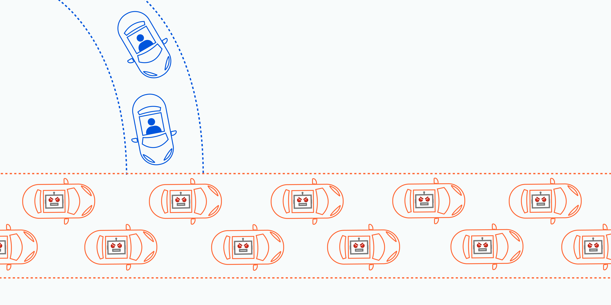

**DDoS Attack: Postmortem Summary**

**Duration:** January 15, 2023, 12:00 PM - January 16, 2023, 8:00 AM (CST)
**Impact:** A video conferencing application was slow and unstable, affecting 90% of users.

**Root Cause:** A third-party service provider experienced a DDoS attack, causing a delay in response times.

From a high level, a DDoS attack is like an unexpected traffic jam clogging up the highway, preventing regular traffic from arriving at its destination.

**Timeline:**

- January 15, 2023, 12:00 PM - Users began experiencing slow and unstable connections.
- January 15, 2023, 12:15 PM - The operations team received several customer complaints about the service being slow and unstable.
- January 15, 2023, 12:30 PM - The operations team discovered that the application was experiencing high network latency.
- January 15, 2023, 1:00 PM - The operations team started investigating the issue and checked the application logs for any errors.
- January 15, 2023, 2:00 PM - The operations team found that the issue was related to a third-party service provider and reached out to their support team.
- January 15, 2023, 3:00 PM - The third-party service provider confirmed that they were experiencing a DDoS attack that was affecting their response times.
- January 15, 2023, 4:00 PM - The operations team informed users of the issue and provided regular updates on the progress of the resolution.
- January 16, 2023, 8:00 AM - The third-party service provider mitigated the DDoS attack, and the video conferencing application returned to normal.

**Root Cause and Resolution:**

The root cause of the issue was a DDoS attack on a third-party service provider, causing a delay in response times. The issue was resolved after the third-party service provider mitigated the DDoS attack, and the video conferencing application returned to normal.

**Corrective and Preventative Measures:**

**To prevent similar issues from occurring in the future, the operations team will take the following actions:**

- Implement redundant service providers: The operations team will implement redundant service providers to ensure that the application remains available even if one service provider experiences an outage.

- Improve communication: The operations team will improve communication with third-party service providers to ensure that they receive timely updates on any potential issues.

- Increase monitoring: The operations team will increase monitoring of the system to detect any potential issues before they cause an outage.

**Tasks to address the issue:**

- Implement redundant service providers: The operations team will implement redundant service providers to ensure that the application remains available even if one service provider experiences an outage.

- Improve communication: The operations team will improve communication with third-party service providers to ensure that they receive timely updates on any potential issues.

- Increase monitoring: The operations team will increase monitoring of the system to detect any potential issues before they cause an outage.

- Update the incident response plan: The operations team will update the incident response plan to include procedures for dealing with issues related to third-party service providers.

In the end, we were able to restore our website to normal operation. We'd like to thank our team for their quick and effective response, and our users for their patience and understanding during the downtime. **As they say, "When life gives you DDoS attacks, make lemonade... or something like that!" Moving forward, we'll be sure to have a few more tricks up our sleeves to ensure uninterrupted services.**